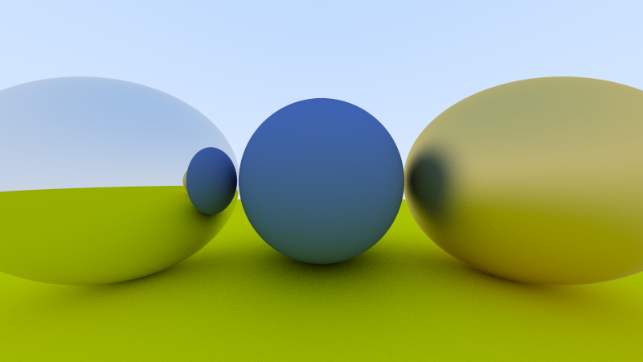

# raytracer-jax

A simple raytracer written JAX. The code more or less follows the great [Raytracing in a Weekend](https://raytracing.github.io/books/RayTracingInOneWeekend.html) until around chapter 11.2. The code passes static mypy checks and the dynamic runtime checks of [beartype](https://github.com/beartype/beartype).

Creates beautiful balls like this:

